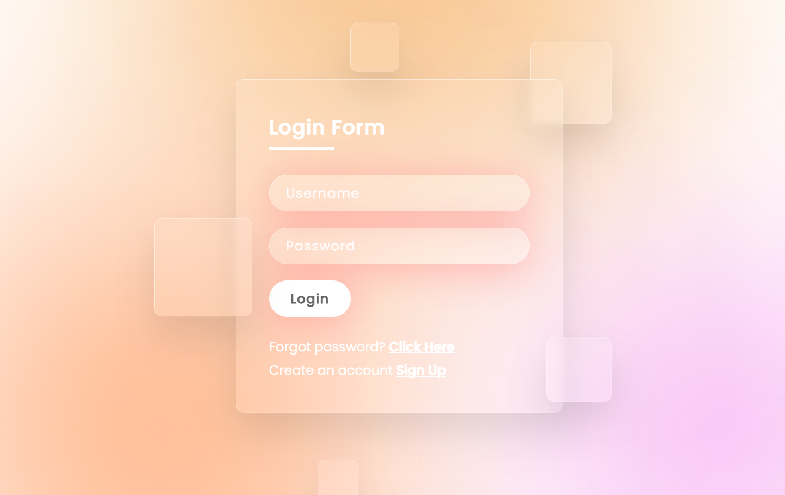

## 🍵💻| Project 01
### GlassMorphism Login Form 📝
>Status: *Completed*

This GlassMorphism Login form is a sleek and modern user interface built entirely using HTML and CSS. Inspired by the popular Glassmorphism design trend, this project features a frosted glass-like effect on the login elements, adding a touch of elegance to the form. Users can effortlessly enter their credentials in this visually appealing and user-friendly interface, making it an excellent addition to any web application or website.

  
  

 
 
 
 
 

credit: *"Online Tutorials"* (https://www.youtube.com/@OnlineTutorialsYT).

